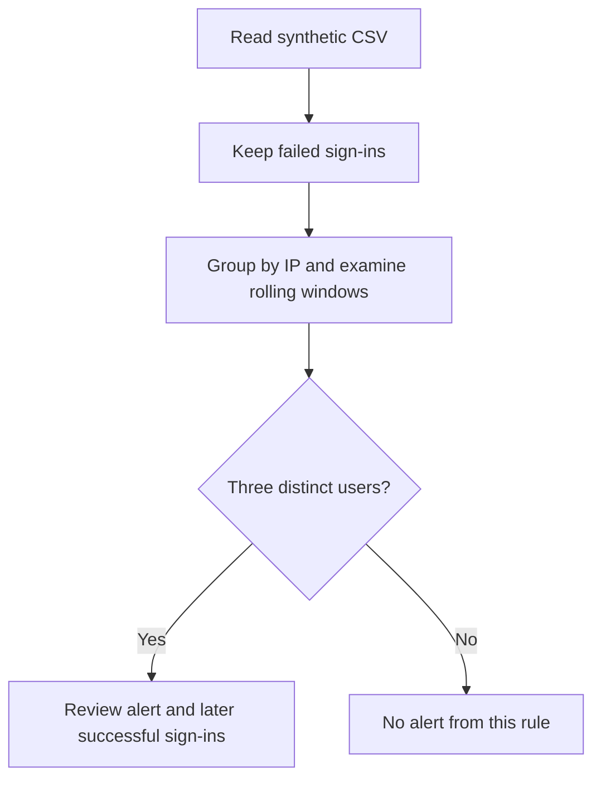

# Identity Security Lab: Detecting a Password Spray

**Beginner lab · Python · Log analysis · Incident triage**

Investigate a simulated sign-in incident: one IP fails to sign in to three accounts, then successfully signs in to one of them. Build evidence, explain the detection, and decide what you would investigate next.

This project uses synthetic, normalized sign-in data inspired by Microsoft Entra ID. It runs entirely on your computer. No Azure account, paid services, external Python packages, or real attack traffic are needed.

## The security question

**When does a collection of failed logins become worth investigating?**

A password spray tries a small number of passwords across many accounts. The logs here show a pattern consistent with spraying; they do not contain the attempted passwords, so the technique cannot be proven from these fields alone.

The rule flags **three distinct users with failed sign-ins from the same IP within ten minutes**. You then manually investigate a subsequent successful sign-in.

## Start here

1. Install Python 3.10 or newer if needed.
2. Extract the ZIP and open the folder containing this README in a terminal.
3. Follow [the step-by-step walkthrough](docs/WALKTHROUGH.md).

On Windows PowerShell:

```powershell
py -3 -m unittest discover -s tests -v
py -3 src/detect.py data/spray.csv --output evidence/my-alerts.json
py -3 src/detect.py data/benign.csv
```

On macOS/Linux, replace `py -3` with `python3`.

**Expected:** 12 tests pass; the spray file produces one alert for `198.51.100.10`; the benign file returns `[]`.

## What you will demonstrate

| Skill | Evidence you create |
|---|---|
| Log analysis | A timeline of the failures and subsequent success |
| Detection logic | An explanation of distinct accounts and a rolling window |
| Validation | Positive, negative, and threshold tests |
| Incident triage | A reasoned assessment and next investigative steps |
| Technical writing | Your completed investigation report |

## Lab flow



## Repository guide

| File | Purpose |
|---|---|
| `src/detect.py` | Password spray detector with input validation and JSON export |
| `data/spray.csv` | Suspicious sign-ins followed by a successful login |
| `data/benign.csv` | Sample activity that should not trigger the rule |
| `tests/test_detect.py` | 12 automated detection tests |
| `docs/WALKTHROUGH.md` | Setup instructions and lab exercises |
| `docs/MY-INVESTIGATION.md` | Completed investigation and findings |
| `docs/PUBLISHING.md` | Publishing guidance and portfolio wording |
| `evidence/my-alerts.json` | Alert generated during my lab run |
| `evidence/evidence01-lab-results.png.png` | Passing tests, alert, timeline, and benign result |
| `evidence/02-threshold-test.png` | Four-account threshold test |
| `evidence/expected-alerts.json` | Reference alert output |
| `evidence/verification.txt` | Verification results from lab preparation |

## How the detector works

It validates and normalizes CSV rows, sorts failures by time within each IP, and checks rolling windows. A window includes events exactly ten minutes apart. Repeated failures for one account do not increase the distinct-user count. Usernames are compared without case differences. Timestamps are normalized to UTC.

For simplicity, it emits **only the first qualifying window per IP per run**. Counts describe that window, not all activity in the file. Successes are excluded from detection and must be reviewed separately. No alert means only that this rule did not match.

## Limits and improvements

This small rule can miss distributed or slow attacks. Shared public IPs can also produce false positives. It does not inspect passwords, classify failure reasons, deduplicate source events, or prove compromise. Duplicate rows can inflate failed-attempt counts but cannot create additional distinct users.

A sensible next step is to add a test and logic for correlating later successful sign-ins. After that, consider adapting the rule to authorized tenant logs and distinguishing credential failures from other unsuccessful results.

## Relationship to Entra ID

These CSV files are a simplified training schema, not native Entra exports. A future adapter would map event time, `UserPrincipalName`, `IPAddress`, and `ResultType` into the lab fields. Microsoft documents `ResultType` as `0` for success and other values for failures; production detections should consider the specific result codes.

References:

- [Microsoft: SigninLogs schema](https://learn.microsoft.com/en-us/azure/azure-monitor/reference/tables/signinlogs)
- [Microsoft: Sign-in activity details](https://learn.microsoft.com/en-us/entra/identity/monitoring-health/concept-sign-in-log-activity-details)

**Status:** Offline simulation. Local Python tests and sample runs were verified during preparation. No live Entra/Sentinel integration has been deployed or validated.
